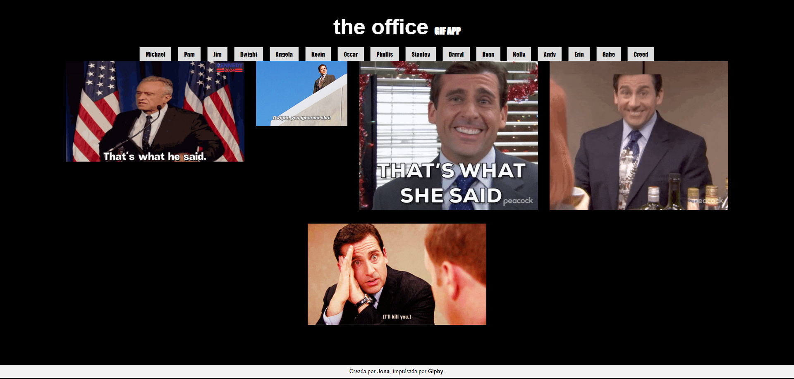

# The Office Giff App


Este es un repositorio para observar gifs sobre varios personajes de The Office.

Fue construido por [Jona](https://github.com/jona0707), trabaja con [Giphy](https://developers.giphy.com/) y está basado en uno de los proyectos construidos en el curso [React: De cero a experto (Hooks y MERN)](https://www.udemy.com/course/react-cero-experto/) de Fernando Herrera.

### Replicarlo
Se deberá tener instalado node y npm, luego algunas bibliotecas serán descargadas al momento de instalar.
<br>

Una vez copiado el repositorio, simplemente se deberán instalar las dependencias desde la carpeta root con ````npm install````. Esto será suficiente ya que este es un proyecto de Frontend, con React.
<br>

Se deberá crear una api key en Giphy creando una cuenta y obteniendo una en la sección de desarrolladores (con el link previamente proporcionado) y esta deberá ir en src/helpers/api.js
<br>

### Construcción y subida a producción
Finalmente, si se trabajó con vite se puede compilar el proyecto usando ````npm run build```` y se obtendrá la versión final, que puede ser subida a GitHub Pages como es el caso. 

Puedes ponerlo a prueba en: https://jona0707.github.io/TheOfficeGifApp/

<hr>

This is a repository to watch gifs about several characters from The Office.

It was built by [Jona](https://github.com/jona0707), works with [Giphy](https://developers.giphy.com/) and is based on one of the projects built in the course [React: From Zero to Expert (Hooks and MERN)](https://www.udemy.com/course/react-cero-experto/) by Fernando Herrera.

### Replication
You should have Node and npm installed, and some libraries will be downloaded during installation.

Once you've copied the repository, simply install the dependencies from the root folder with `npm install`. This will be sufficient since this is a Frontend project with React.

You'll need to create a Giphy API key by creating an account and obtaining one in the developers' section (using the previously provided link), and this should be placed in `src/helpers/api.js`.

### Building and Deployment
You can compile the project using Vite by running `npm run build`. This will generate the final version of the project. The final version can be uploaded to GitHub Pages.

You can try it at: https://jona0707.github.io/TheOfficeGifApp/
